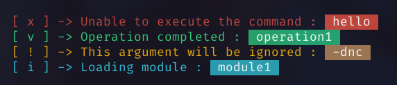
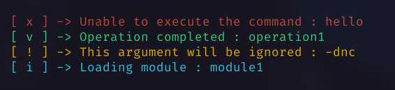
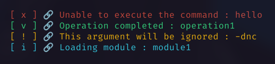
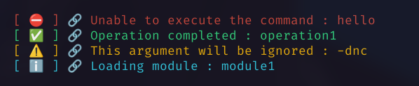
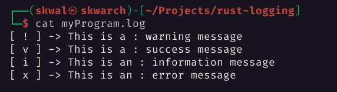

# Rust logging ⛔



💬 A couple of functions to make logging in Rust easier.

# Installation 📦

```toml
# Cargo.toml
[dependencies]
rust_logging = "1.0.0"
```

# Usage 📝

## Initializing

```rs
use rust_logging::*;

fn main() { 
    // With default settings
    let default_logger = Logger::new();

    // With custom settings
    let settings = LoggerOptions {
        error_icon: "💥", // the icon for errors
        warn_icon: "⚠️", // the icon for warnings
        info_icon: "ℹ️", // the icon for info
        success_icon: "✅", // the icon for success
        icon_connector: "=>", // the connector between the icon and the message
        log_file: "log.txt", // the file to log to when logging to a file
        highlight: true, // highlight text after ":" in the message
        ..Default::default() // the default values for the non specified settings
    }

    let custom_logger = settings.get_logger();
}
```

## Logging

This code provides the following functions:

- 🟡 **warn()**: Prints a warning message.
- 🔴 **error()**: Prints an error message.
- 🔵 **info()**: Prints an information message.
- 🟢 **success()**: Prints a success message.
- ℹ️ Add a `f` before the function name to print the message to the log file

Each function takes a single parameter, which is the message to be printed.

```rust
logger.error("a command failed : hello"); 
logger.info("executing command : hello");
logger.warn("a command is about to fail : hello");
logger.success("a command succeeded : hello");
```

## Highlighting 🔍

By default, the text after the colon is highlighted.


This can be disabled by setting the `highlight` field to `false` inside the custom settings.

```rs
let settings = LoggerOptions {
    highlight: false,
    ..Default::default()
}

let logger = settings.get_logger();
```



## Icon connector 🔗

By default, the icon and the message are separated by an arrow `->`


You can change this by setting the `icon_connector` field to something else.

```rs
let settings = LoggerOptions {
    icon_connector: "=>",
    ..Default::default()
}

let logger = settings.get_logger();
```



## Icons 🔍

By default, the following icons are used:

| Icon  | Function  |
| ----- | --------- |
| [ x ] | error()   |
| [ i ] | info()    |
| [ v ] | success() |
| [ ! ] | warn()    |

You can change this by setting the following fields inside the custom settings:

```rust
let settings = LoggerOptions {
    error_icon: "💥",
    warn_icon: "⚠️",
    info_icon: "ℹ️",
    success_icon: "✅",
    ..Default::default()
}

let logger = settings.get_logger();
```



## Log file 📄

You can specify the log file path to write the messages to with the `log_file` field.

Use the `f` prefix before the function name to print the message to the log file.

```rust
let settings = LoggerOptions {
    log_file: "myProgram.log",
    ..Default::default()
}

let logger = settings.get_logger();

// -----------------------------

logger.fwarning("This is a : warning message");
logger.fsuccess("This is a : success message");
logger.finfo("This is an : information message");
logger.ferror("This is an : error message");
```



## also logging to terminal when logging to file 📄

You can set environment variable `LOG` to `print` to also log to the terminal when logging to a file.

```bash
LOG=print [program]

#########
# PROGRAM SOURCE CODE #
# ferror("This is an : error message");
#########

[Terminal output] : 

[ x ] -> This is an : error message

#########
# LOGFILE CONTENT #
# [ x ] -> This is an : error message
#########
```

# final

If you have any problem, don't hesitate to open an issue

# contributing

Pull requests are welcome. For major changes, please open an issue first to discuss what you would like to change.

<a href="https://github.com/SkwalExe#ukraine"></a>